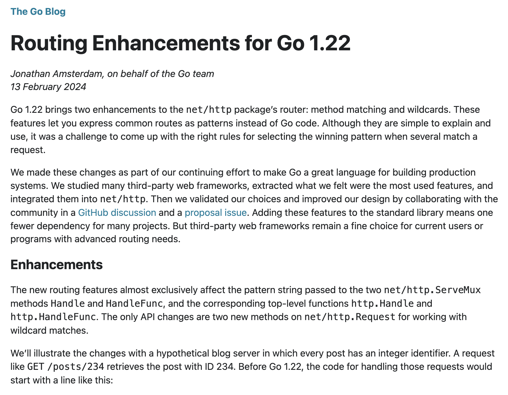
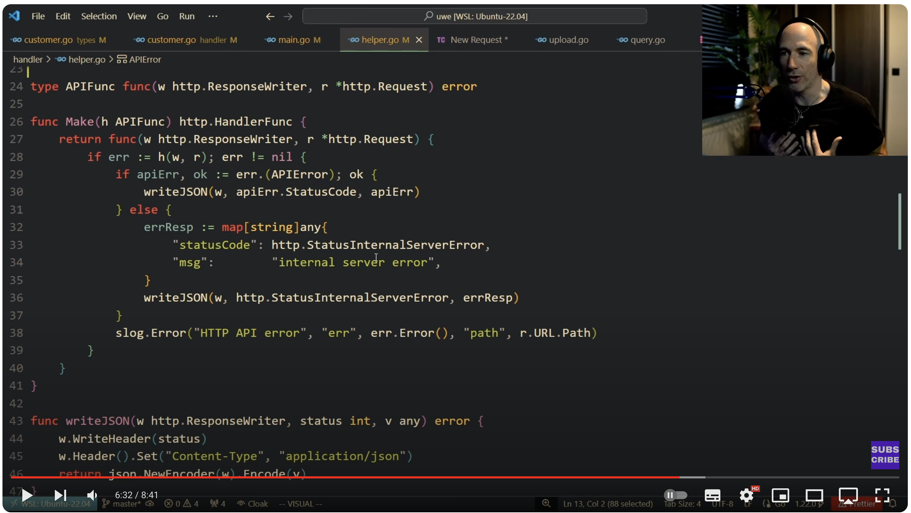
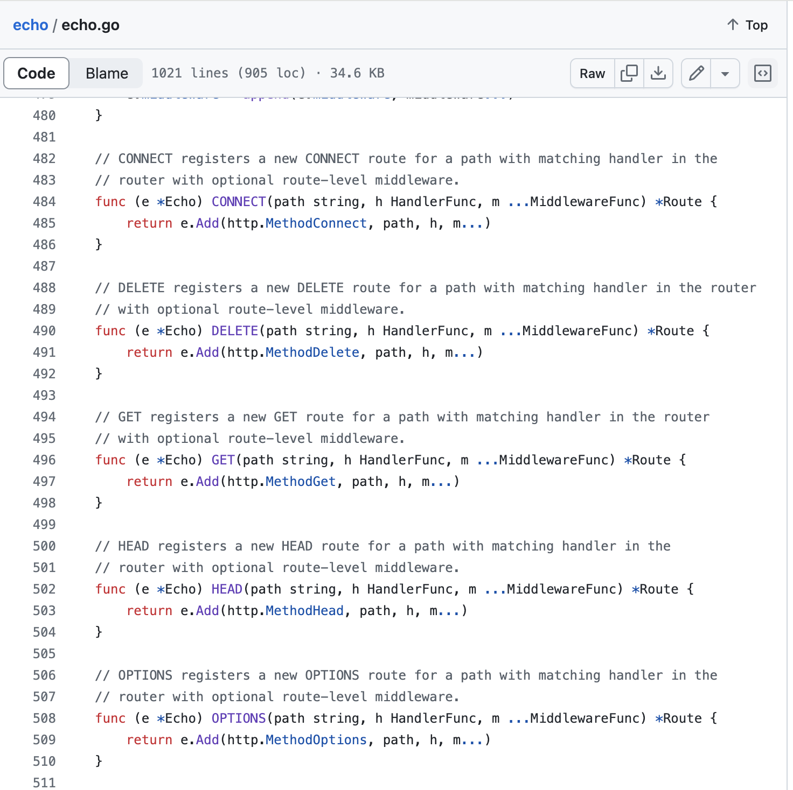

# Is Go 1.22's net/http ServeMux all you need?

With the introduction of Go 1.22, is there any reason now to consider 3rd party frameworks?

---

## Introduction - Frameworks

- `net/http` from the Standard Library
- [Gin - https://github.com/gin-gonic/gin](https://github.com/gin-gonic/gin)
  - Fast, built on top of [HTTPRouter - https://github.com/julienschmidt/httprouter](https://github.com/julienschmidt/httprouter) instead of (`net/http`)
- [Fiber - https://github.com/gofiber/fiber](https://github.com/gofiber/fiber)
  - Again, fast, but built on top of [https://github.com/valyala/fasthttp](https://github.com/valyala/fasthttp) but lack of HTTP/2
  - Handler's resemble gRPC (I'll come back to this)
- [Go Chi - https://github.com/go-chi/chi](https://github.com/go-chi/chi)
  - Built on `net/http`, Good middleware
- [Echo - https://echo.labstack.com](https://echo.labstack.com)
  - Built on `net/http`, Good middleware
  - Handler's resemble gRPC (I'll come back to this)

---

## My pre-Go1.22 choice

As an engineer who has been writing gRPC microservices, I'm used to writing "handlers" that tend to follow this pattern:

```go
func DoThing(ctx context.Context, req *Request) (*Response, error)
```

Also, I would like some useful syntactic suger. I'm also risk adverse to diverging from `net/http` code.

So, that led me to Echo.

---

## Sample Echo code

Let's look at a simple server implementation.
There's no real implemention code. We'll just implement the router and some middleware only.

---

## Features we may consider

- 1: Routing (functions for specific http Methods): [https://echo.labstack.com/docs/quick-start#routing](https://echo.labstack.com/docs/quick-start#routing)
- 2: Path Params: [https://echo.labstack.com/docs/quick-start#path-parameters](https://echo.labstack.com/docs/quick-start#path-parameters)
- 3: Groups in Routing: [https://echo.labstack.com/docs/routing#group](https://echo.labstack.com/docs/routing#group)
- 4: Middleware: [https://echo.labstack.com/docs/quick-start#middleware](https://echo.labstack.com/docs/quick-start#middleware)
  - Convenient and easily understandable interface to add middlware

---

## CODE DEMO

---


## ... and the Standard Library?

Although code reuse has it's benefits, there are also costs. Russ Cox (co-creator) of Go has discussed this before ( [https://research.swtch.com/deps](https://research.swtch.com/deps) )

Can we easily achieve the same using the new Standard Library only?
Ref: [https://go.dev/blog/routing-enhancements](https://go.dev/blog/routing-enhancements)

---

## CODE DEMO

---

## Review (1)

> "is there any reason now to consider 3rd party frameworks?"

Has the new standard library filled the gaps we had?

- 1: Routing (functions for specific http Methods)
  - Yes. It's an improvement.
  - But, lack of compile time "safety"

```golang
notesGroup.GET("/:id", routes.GetNote) // ECHO

notesGroup.HandleFunc("GET /notes/{id}", routes.GetNote) // Go 1.22 std lib
```

- 2: Path Params
  - Yes. This is is much needed improvement over pre Go1.22

---

## Review (2)

- 3: Groups in Routing
  - This has always been possible pre-Go1.22
  - But the way to setup is not as obvious
    - We could write our own abstraction?
- 4: Middlware
  - Again, this has always been possible pre-Go1.22
    - We could write our own abstraction?

---

## What about centralised error handling?

From [https://echo.labstack.com/docs/error-handling](https://echo.labstack.com/docs/error-handling)

> Echo advocates for centralized HTTP error handling by returning error from middleware and handlers. Centralized error handler allows us to log errors to external services from a unified location and send a customized HTTP response to the client.

I agree with this, I like my handler functions taking the form `func CreateNote(c echo.Context) error`

---

## ... something like this?

- I won't take the credit for this code
- This was code presented by [Anthony GG](https://youtu.be/aS1cJfQ-LrQ?si=yNIrI3bBawTLDg-e&t=392)
- It shows how we can wrap the Handler functions ourselves instead of relying on a library



---



## Echo's current status

- Version 5 is taking time; [ticket reference from 2021](https://github.com/labstack/echo/discussions/2000)
  - It's router is not taking advantage of the new features from `net/http`
    - The code is well tested, but ...
  - This would simplify Echo so we can easily take advantage of it's "quality of life" abstractions such as middlware and grouping etc.

---

## Conclusions

- It's going to be a personal or pragmatic choice.
  - For a simple personal project with minimal routing requirements, I will now stick with net/http alone
  - Larger projects with more complex middleware and routing requirements, I would still probably stick with Echo for now, and watch what else emerges.
- Recently (in the last 4 days), I found "Michi".
  - [https://github.com/go-michi/michi](https://github.com/go-michi/michi)
  - May be worth considering
  - I've also asked the Echo developers about this approach.
